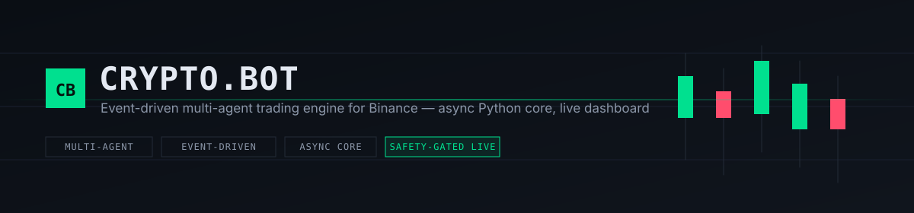

<p align="center">
  
</p>

<h1 align="center">CRYPTO.BOT</h1>

<p align="center">
  Motor de trading algorítmico <strong>orientado a eventos</strong>, com arquitetura
  <strong>multi-agent</strong> e <strong>async</strong> — do sinal de mercado à execução,
  com um dashboard em tempo real e uma trava de segurança que ninguém consegue burlar por acidente.
</p>

<p align="center">
  <a href="https://github.com/julianscunha/Crypto.Bot/actions/workflows/ci.yml"></a>
  
  
  
  
  <a href="CONTRIBUTING.md"></a>
  <a href="SECURITY.md"></a>
</p>

<p align="center">
  <a href="#início-rápido">Início rápido</a> ·
  <a href="#por-que-cryptobot">Por que Crypto.Bot</a> ·
  <a href="#arquitetura">Arquitetura</a> ·
  <a href="#dashboard">Dashboard</a> ·
  <a href="#segurança-e-guardrails">Segurança</a> ·
  <a href="docs/README_FULL.md">Documentação completa</a>
</p>

---

> ⚠️ **Trading envolve risco real de perda de capital.** Este projeto é
> oferecido para fins educacionais e de pesquisa. O modo `paper` (simulado)
> é o padrão e a forma recomendada de explorar o projeto; o modo `live`
> exige três confirmações explícitas (veja [Segurança e guardrails](#segurança-e-guardrails))
> e ainda não foi validado contra a API real da Binance neste ambiente de
> desenvolvimento — veja [Maturidade do projeto](#maturidade-do-projeto).

## Por que Crypto.Bot?

- **Arquitetura de verdade, não um script.** Cinco agentes desacoplados
  (`Analyst → Strategy → Risk → Execution → PositionManager`) conversam
  exclusivamente por um `EventBus` — nenhum atalho, nenhuma chamada direta
  entre eles. Trocar ou testar um agente isoladamente não quebra o resto.
- **Segurança de dinheiro real como default, não como opção.** Enviar uma
  ordem real exige três flags simultâneas (`MODE=live` + `BINANCE_TESTNET=false`
  + `LIVE_TRADING_CONFIRMED=true`), checadas em pontos independentes do
  código. Fronteira de tenant/símbolo validada em `RiskAgent`/`ExecutionAgent`
  antes de qualquer cálculo de risco.
- **Testado de verdade.** 649 testes automatizados (`pytest` + `pytest-asyncio`)
  cobrindo os 5 agentes, o gate de live trading, reconciliação de startup e
  o client da Binance — rodando em CI a cada PR, junto com o lint (`ruff`,
  `oxlint`) e a suíte do frontend (`vitest`).
- **Dashboard que parece produto, não painel de debug.** React 19 + Vite,
  tema dark "terminal" desenhado para leitura rápida de números — equity,
  PnL, drawdown, win rate e performance ajustada a risco (Sharpe, Sortino)
  em tempo real.
- **Backtest e optimizer com dados reais da Binance** (com fallback para
  fixtures sintéticas só se o fetch falhar) — rodáveis direto pela
  interface, com progresso em tempo real e histórico
  das últimas execuções.
- **Honesto sobre o que ainda não foi validado.** Veja [Maturidade do
  projeto](#maturidade-do-projeto) — preferimos um número exato do que
  falta a uma promessa vaga de "100% pronto".

---

## Índice

- [Início rápido](#início-rápido)
- [Docker](#docker)
- [Configuração](#configuração)
- [Arquitetura](#arquitetura)
- [Funcionalidades](#funcionalidades)
- [Stack](#stack)
- [Modos de execução](#modos-de-execução)
- [Dashboard](#dashboard)
- [Segurança e guardrails](#segurança-e-guardrails)
- [Testes](#testes)
- [Banco de dados](#banco-de-dados)
- [Regras de domínio](#regras-de-domínio)
- [Maturidade do projeto](#maturidade-do-projeto)
- [Contribuindo](#contribuindo)
- [Documentação completa](#documentação-completa)
- [Licença](#licença)

---

## Início rápido

**Pré-requisitos:** Python 3.11+, Node.js 20+ (só para o dashboard), git.
Conta na Binance é opcional — só necessária para os modos `live`/testnet;
`paper` e backtest rodam sem nenhuma credencial.

```bash
git clone https://github.com/julianscunha/Crypto.Bot.git
cd Crypto.Bot
cp .env.example .env
```

Depois de ajustar o `.env` (veja [Configuração](#configuração)):

```bash
# Windows
./scripts/start.ps1

# Linux / macOS
./scripts/start.sh
```

Ambos abrem o launcher interativo (`scripts/bootstrap/launcher.py`), que
valida o ambiente, instala as dependências Python automaticamente e mostra:

```text
[1] Runner       -> apps.trader.runner (paper/live trading)
[2] Optimizer    -> backtest.optimizer.optimizer_engine
[3] Backtest     -> backtest.runner
[4] Frontend     -> npm run dev (frontend/)
[5] Full Stack   -> API + Runner + Frontend
```

`Full Stack` sobe a API (`http://127.0.0.1:8000`), o Runner e o dashboard
(`http://localhost:5173`) juntos, instalando `frontend/node_modules`
automaticamente se ausente.

---

## Docker

```bash
cp .env.example .env
docker compose up --build
```

Três containers (API, Runner, frontend via nginx) — dashboard em
`http://localhost:8080`, API em `http://localhost:8000`. Guia completo
(variáveis, segurança antes de expor além de localhost, backup do banco
em container) em [`docs/DEPLOYMENT.md`](docs/DEPLOYMENT.md).

---

## Configuração

Toda a configuração vive no `.env` (nunca commitado — use `.env.example`
como template). As variáveis mais importantes:

| Variável | Padrão | O que faz |
|---|---|---|
| `MODE` | `paper` | `paper` simula execuções; `live` tenta ordens reais (veja a trava abaixo). |
| `BINANCE_TESTNET` | `true` | `true` usa a Testnet da Binance; `false` aponta para mainnet. |
| `BINANCE_API_KEY` / `BINANCE_SECRET_KEY` | vazio | Credenciais da API. Deixe vazio para rodar só em `paper`. |
| `LIVE_TRADING_CONFIRMED` | `false` | Trava explícita e separada de `MODE`/`BINANCE_TESTNET` — só as três condições juntas liberam ordens reais em dinheiro real. |
| `ACCOUNT_BALANCE` | `100.0` | Saldo usado pelo motor de risco para dimensionar posições. |
| `SYMBOLS` | `BTCUSDT,ETHUSDT,SOLUSDT` | Pares monitorados. |
| `KLINE_INTERVAL` | `1m` | Timeframe dos candles. |
| `API_ACCESS_TOKEN` | vazio | Token exigido no header `X-API-Token` para as rotas sensíveis da API. Obrigatório se `API_HOST` for além de `localhost` — trate como uma credencial de produção. |

Você também pode gerenciar chaves da Binance e o modo de execução pela
aba **Operação** do dashboard, sem editar o `.env` manualmente.

---

## Arquitetura

```text
BinanceWS
    ↓
EventBus
    ↓
AnalystAgent  →  StrategyAgent  →  RiskAgent  →  ExecutionAgent  →  PositionManagerAgent
```

Cada agente implementa `async def on_message` e só fala com o resto do
sistema publicando/assinando mensagens no `EventBus` — nunca chamando
outro agente diretamente. Isso mantém cada estágio do pipeline testável
isoladamente (veja [Testes](#testes)) e torna adicionar um sexto agente,
ou trocar a estratégia, uma mudança localizada.

---

## Funcionalidades

- Engine orientada a eventos, 100% async
- Trading multi-symbol com isolamento por `user_id`
- Engine de volatilidade ATR + validação de tendência EMA + market structure
- Gestão de risco com limite de exposição e position sizing dinâmico
- Trailing stop, breakeven e take-profit dinâmico
- Analytics de portfolio (Sharpe, Sortino, drawdown, profit factor, streaks)
- Ingestão via WebSocket da Binance + reconciliação de startup
- Backtest/optimizer paralelizado com dados históricos reais
- Dashboard React em tempo real com 4 telas dedicadas

---

## Stack

**Backend:** Python 3.11 · AsyncIO · FastAPI · SQLAlchemy · SQLite · Alembic
**Frontend:** React 19 · Vite · Vitest
**Infra:** Docker · GitHub Actions (CI) · `ruff` / `oxlint`

---

## Modos de execução

- **PAPER** — execuções simuladas, sem ordens reais. Padrão e forma
  recomendada de explorar o projeto.
- **LIVE** — ordens reais na Binance (testnet ou mainnet), travado atrás de
  três confirmações independentes — veja [Segurança e guardrails](#segurança-e-guardrails).
- **BACKTEST** — replay de dados históricos via `backtest/runner.py` ou o Optimizer.

---

## Dashboard

React + Vite, tema dark desenhado para leitura rápida em produção — não é
uma tela de debug. Quatro telas:

- **Monitor** — equity/PnL/drawdown em tempo real, win rate, trades abertos
  e recém-fechados, atividade do pipeline de sinais, gráfico de PnL,
  circuit breaker de risco diário e performance ajustada a risco.
- **Operação** — troca de modo (Paper/Live, com confirmação e reinício
  automático — bloqueado com posição aberta) e credenciais da Binance
  (segredos nunca são reenviados pela API depois de salvos).
- **Ferramentas** — Optimizer e Backtest contra dados reais da Binance
  direto pela interface, com progresso em tempo real, estimativa de
  duração e histórico das últimas execuções.
- **Configurações** — pares monitorados, candles e todos os parâmetros de
  risco/ATR/sinal/estrutura, com aviso claro de quando uma mudança exige
  reiniciar o bot manualmente — ele nunca reinicia sozinho.

```bash
cd frontend && npm install && npm run dev   # http://localhost:5173
```

---

## Segurança e guardrails

Dinheiro real não sai por acidente. O caminho até uma ordem real passa por
quatro camadas independentes, cada uma capaz de bloquear por conta própria:

1. **Gate de três flags** — `MODE=live` **e** `BINANCE_TESTNET=false` **e**
   `LIVE_TRADING_CONFIRMED=true`, checado tanto no `BinanceTradingClient`
   quanto no `execution_router` — nunca só num lugar.
2. **Fronteira de tenant/símbolo** — `RiskAgent`/`ExecutionAgent` validam
   `user_id` e `symbol` (contra a allowlist configurada) antes de qualquer
   cálculo de risco ou execução.
3. **Reconciliação de startup** — ao subir, o sistema audita posições
   abertas, OCOs órfãs na Binance e ordens sem trade local, antes de deixar
   o bot operar.
4. **Comparação de token constant-time** na API (`hmac.compare_digest`),
   rate limiting e CORS restrito nas rotas sensíveis.

Encontrou uma falha de segurança? Veja [`SECURITY.md`](SECURITY.md) — não
abra uma issue pública.

---

## Testes

```bash
pip install -r scripts/bootstrap/requirements.txt pytest pytest-asyncio pytest-cov
python -m pytest tests/
```

649 testes, banco SQLite/`.env`/logs isolados e temporários — a suíte
nunca toca `data/storage/trades.db`, o `.env` ou os `logs/` reais (veja
`tests/conftest.py`). Roda em CI a cada PR junto com `ruff check`.

```bash
cd frontend && npm test   # Vitest + Testing Library
```

---

## Banco de dados

```bash
alembic upgrade head
```

---

## Regras de domínio

Invariantes que o código inteiro depende para funcionar corretamente —
detalhe completo em `CLAUDE.md`/`AGENTS.md`:

- Nunca remover `user_id` dos payloads — o sistema é multi-tenant.
- Nunca usar `payload.price`; sempre `entry_price`.
- Toda comunicação entre agentes passa pelo `EventBus`.
- Todo agente implementa `async def on_message`.

---

## Maturidade do projeto

Preferimos dizer exatamente o que já foi validado e o que ainda depende de
teste manual, em vez de arredondar para "pronto":

```text
Core Infrastructure ........... 96%
Trading Engine ................ 93%
Lifecycle Engine .............. 94%
Portfolio Engine .............. 90%
Persistence Layer ............. 90%
Exchange Integration .......... 78%
Risk & Analytics ............... 85%
Production Hardening .......... 92%
Frontend ....................... 75%
Deploy (Docker) ................ 90%

TOTAL: ~88%
```

Esses números são autoavaliação qualitativa (não cobertura de linhas ou
requisitos formais fechados) — trate como maturidade relativa entre
módulos. O gap real, único e conhecido: **nenhuma parte do fluxo de
execução foi validada contra a API real da Binance** (nem testnet) neste
ambiente de desenvolvimento, por falta de acesso de rede — só pode ser
feito manualmente, com um checklist dedicado em
[`docs/README_FULL.md`](docs/README_FULL.md#live-trading). Use `paper`
até rodar esse checklist você mesmo.

---

## Contribuindo

Contribuições são bem-vindas — veja [`CONTRIBUTING.md`](CONTRIBUTING.md)
para como configurar o ambiente de dev, rodar a suíte antes de abrir um PR
e o padrão de commit esperado.

---

## Documentação completa

Este README cobre o essencial para rodar o projeto. Para o detalhamento de
cada engine, payload contracts e o motivo por trás de decisões de design
não óbvias, veja [`docs/README_FULL.md`](docs/README_FULL.md).

---

## Licença

Distribuído sob a licença [MIT](LICENSE).
